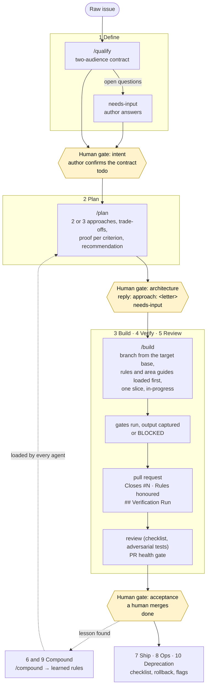

# aifier

**Make your existing codebase a place where AI agents can work safely.**

aifier audits a repository, tells you exactly what is missing for coding agents to operate under
human control, then installs it: a constitution for agents, verification gates with proof, an
issue-based workflow with human gates, and a catalogue of learned rules that grows with every cycle.

It is a method first and a toolkit second. Everything it installs is plain Markdown and YAML,
versioned in your repo, and portable across Claude Code, opencode and pi.

[](LICENSE)
[](#status)

---

## Who it is for

- **Tech leads and architects** who want to let agents touch a real, aging codebase without
  giving up control of intent, architecture and release.
- **Teams already using Claude Code, Cursor, opencode or Copilot** who feel the agent "doesn't know
  the project": wrong conventions, repeated mistakes, confident claims that nothing proves.
- **Platform and DevEx engineers** asked to "roll out AI" across many repositories with one
  consistent, auditable setup.
- **Consultants and coaches** who need a repeatable way to assess a client's readiness and bring
  a project to a known state.

If you have one agent working on a weekend side project, you do not need aifier. If you have a
team, a backlog, a CI and something in production, you do.

## The problem it solves

Agents are good at writing code and bad at knowing where they are. Dropped into an existing
repository they:

- ignore conventions nobody wrote down, and reinvent what already exists;
- make the same mistake in every session, because nothing remembers the last review;
- say "tests pass" without the output to prove it;
- decide intent, architecture and merge on their own, because nothing told them to stop.

The usual answer is a longer prompt. It does not scale. What scales is a **harness**: written
context at the right altitude, mechanical gates that produce evidence, a workflow that stops at the
decisions humans must own, and a loop that turns every lesson into a rule.

## What you get

aifier brings a repository to the **Setup** phase of the
[AI-augmented SDLC](https://www.sfeir.com/concepts/sdlc-augmente/): eleven phases, three human
gates (intent, architecture, acceptance), two capitalisation points (before release, from
production).

aifier is installed once into your repository and then runs **inside your coding agent**: the
skills are plain `SKILL.md` files that Claude Code, opencode and pi all load. See
[Install aifier into your project](#install-aifier-into-your-project).

## Install aifier into your project

**What you need.** A git repository, a POSIX shell with `git`, `curl` and `tar` (macOS, Linux,
WSL, Git Bash), and a coding agent that loads skills (Claude Code, opencode or pi). `gh` and `jq`
let `assess` and `gate` read the forge; without them those parts say so and go on. Nothing else:
no Python, no Node, no Rust on the machine that uses aifier.

**1. Install the skills.** From the root of your repository:

```sh
curl -fsSL https://raw.githubusercontent.com/mickaelandrieu/aifier/main/install.sh | sh
```

The installer copies the skills into `.agents/skills/` (and links `.claude/skills` to it for
Claude Code), puts the `aifier` binary that `init` renders with under `.aifier/bin/` after
checking its sha256 against the release, writes `.aifier/install.yml`, and stops. Options, as
environment variables: `AIFIER_DIR` to choose the skills directory, `AIFIER_REF` to pin a tag
(`v1.2.3`, which is also what selects the binary: a branch carries none), and
`AIFIER_SRC=/path/to/a/clone` to install from a local checkout, which is the way while the
repository is private (the binary is then copied from that clone's `target/release/`, built with
`cargo build --release`). Run it again any time to update: it replaces the skills and the binary
and nothing else. Linux x86_64 and arm64 (WSL included) and macOS Intel and Apple silicon have a
binary; elsewhere the installer says so and `init` asks for a build from source.

**2. Measure.** In your agent, run `/assess`. It is read-only: a score per phase, a verdict, the
gaps in priority order with the action that closes each.

**3. Set up.** Run `/init`. It detects the stack and the areas, shows the `aifier.yml` it inferred,
asks what it could not infer (engine, branches, label prefix, language), then renders the
constitution, the area guides, the issue and pull request templates, the memory files and the
knowledge skills. An existing file is never overwritten silently: you choose merge, side file or
skip for each. It prints the forge commands (labels, branch protection) and runs them only on your
yes. Review the diff and commit it on a branch, like any change.

**4. Declare the gates.** Run `/gates`. It finds lint, typecheck, test and build per area, compares
them with CI, writes them into `aifier.yml`, and installs the runner every agent uses from then on
to end its work with a captured `## Verification Run`.

**5. Work.** Open an issue and run `/qualify`, `/plan`, `/build`: see
[Using it day to day](#using-it-day-to-day). `/status` shows where the project stands; `/compound`
turns a lesson into a rule.

**Remove.** Delete `.agents/skills/` (or your `AIFIER_DIR`), `.claude/skills` if it is a link,
and `.aifier/`. The files `init` rendered are yours: keep them or not. The V2 binary brings
`aifier update` and `aifier remove`, see [ADR 0002](docs/decisions/0002-aifier-binary.md).

What `init` renders into your project:

| Rendered | Role |
|---|---|
| `AGENTS.md` | the constitution: a short map, rules that apply everywhere, pointers to area guides |
| `aifier.yml` | repo, branches, label prefix, gates, language, chosen guards |
| Skills | run by your engine as slash commands: the cycle (`/qualify`, `/plan`, `/build`, each stopping at its gate), the transverse ones (`/assess`, `/gates`, `/context`, `/compound`, `/status`), plus knowledge skills (proof discipline, review checklist, adversarial test plan, ADR and documentation rules) |
| Guards | standalone hooks for your engine that constrain what the model reads and writes: protected paths, forbidden git operations, secrets, a required verification section before the agent stops |
| Memory | the learned-rules catalogue, the decision journal (ADRs) and the session handoff file, all plain Markdown in git |
| Workflow | two-audience issue templates, a PR template with a validation section, workflow labels |

The skills, once in your project:

| Skill | Phase | What it does |
|---|---|---|
| `/assess` | 0 Setup | Read-only maturity audit, phase by phase: a score, a verdict, prioritised gaps and risks. Re-run it any time to see where the project stands. See the [evaluation grid](method/assess.md). |
| `/gates` | 4 Verify | Detects lint, typecheck, test and build commands, declares them, checks they run, installs an environment preflight so a "tests pass" verdict can be trusted. |
| `/context` | CDLC | Audits what agents read: stale files, duplicated knowledge, hot / warm / cold tiering, load per session. |
| `/compound` | 6 and 9 | Captures a lesson as a learned rule, with a wrong example, a right example and an executable detection. Two modes: pre-release and incident. |
| `/status` | all | Where the project stands against the eleven phases, and the next gap. |
| `/gate` | 1 to 3 | Where an issue stands in the cycle, in one line that names the facts it rests on: not qualified, needs input, qualified, planned, chosen, in progress. |
| `/qualify` | 1 Define | Rewrites a raw issue into the two-audience contract (problem, impact, observable acceptance criteria, folded technical analysis), sets the label, and stops: a human confirms the intent. |
| `/plan` | 2 Plan | From a qualified issue, two or three approaches that diverge in strategy, with trade-offs, risks, the rules they honour and a recommendation; posted on the issue, then stops: a human replies `approach: <letter>`. |
| `/build` | 3 Build | From the chosen approach, cuts the branch from the target base, loads the rules and area guides before the first edit, builds one slice, runs the gates and opens a PR ending with a Verification Run. Never merges. |

## How it works

1. **Install and init.** One `curl | sh`, then `aifier init`. aifier detects your stack,
   architecture decisions, CI and engines, shows the manifest it inferred, asks the rest, and
   renders. Existing files are never overwritten silently.
2. **Assess.** Run `/assess` in your engine. You get a profile over the eleven phases, prioritised
   gaps and risks. It reads files, git history and the forge; it changes nothing.
3. **Gates.** Run `/gates`. From now on every agent deliverable ends with the captured output of
   lint, typecheck, tests and build, or an explicit `BLOCKED` with the reason.
4. **Work the cycle.** Issues are qualified into contracts (human gate), planned as two or three
   distinct approaches (human gate), built one slice at a time under the guards, verified with
   proof, reviewed from several angles, and merged by a human (human gate).
5. **Compound.** When a review finds a pattern, or production surfaces an incident, `/compound`
   turns it into a rule. Every agent loads the rules on its next run. The tenth cycle is
   mechanically better than the first.

The three human gates are not optional. The generated skills stop at them by construction, and the
guards refuse the operations that would skip them: nothing decides intent, picks an architecture or
merges a pull request on its own.

## Using it day to day

One issue at a time, the same loop every time. Agents run the skills; humans hold three
decisions. The labels (`<prefix>:todo`, `needs-input`, `in-progress`, `partial`, `done`) carry
the state on the forge, and `/gate` reads it back in one line.



What you type, in order:

| Moment | Command | What happens | It stops when |
|---|---|---|---|
| An issue lands | `/qualify N` | Rewrites it into the contract, grounds the technical part in the code, sets `todo` (or `needs-input` with the questions). | The author confirms the problem and the criteria. |
| Contract confirmed | `/plan N` | Posts two or three approaches that differ in strategy, with the rules each must honour and how each criterion will be proven; sets `needs-input`. | You reply `approach: <letter>` on the issue, amendments in the same comment. |
| Approach chosen | `/build N` | Cuts the branch, loads the learned rules and area guides, builds one slice, runs the gates, opens the pull request with its Verification Run; sets `in-progress`. | The pull request is open. It never merges. |
| Pull request open | review skills | Checklist and adversarial test plan, with the PR health gate: no clean verdict on a red check or a conflict. | A human merges and sets `done`. |
| A lesson appears | `/compound` | Turns it into a rule with a wrong example, a right example and a detection; every agent loads it next run. | The rule is in the catalogue. |
| Any time | `/gate N`, `/status` | Where the issue stands, where the project stands. | Read-only. |

What an agent never does here: decide the intent, pick the approach, merge, mark a pull request
ready, or remove a `need-work` label. Each skill checks the gate behind it before acting and
refuses to go on without the human signal: an unqualified issue is sent to `/qualify`, a plan
without an `approach:` reply waits, an issue already in progress asks before resuming.

## What you gain

- **Control without babysitting.** Humans hold three decisions. Everything between them is
  delegated, with evidence attached.
- **No claim without proof.** "Tests pass" comes with the command and its output, or it is
  `BLOCKED`. Reviews cannot approve a PR with conflicts or failing checks.
- **Mistakes that do not come back.** A bug seen twice is a hole in the system. The rule catalogue
  closes it for every agent, in every session, from the next run.
- **One setup, any engine.** The knowledge lives in portable `SKILL.md` files and the guards are
  rendered for Claude Code, opencode or pi. Switch engine, or run two, without rewriting your
  context.
- **A measurable starting point.** `assess` gives you a score you can re-run after each change.
  Teams following this method report fewer correction iterations after about ten cycles
  ([source](https://www.sfeir.com/concepts/sdlc-augmente/)); the grid lets you check that on
  your own repository rather than take it on faith.

## Grounding

aifier does not invent its vocabulary. It implements publicly documented concepts:

- [AI-augmented SDLC](https://www.sfeir.com/concepts/sdlc-augmente/): the eleven phases, three
  gates and two capitalisations.
- [Harness engineering](https://www.sfeir.com/concepts/harness-engineering/): guides before the
  action, sensors after it, and the harnessability of a codebase.
- [Context engineering](https://www.sfeir.com/concepts/context-engineering/) and the
  [CDLC](https://www.sfeir.com/concepts/cdlc/): context as a versioned dependency, in tiers.
- [Issue-based development](https://www.sfeir.com/concepts/issue-based-development/): report a
  gap, let the agent analyse the system, arbitrate the plan, review, capitalise.
- [Context flywheel](https://www.sfeir.com/concepts/context-flywheel/): why the loop compounds.

The method pages live in [`method/`](method/), starting with the
[eleven phases](method/phases.md) and the [assess grid](method/assess.md).

## Layout

```
install.sh       one-line installer: copies skills/ into .agents/skills/
method/          the method, one page per phase and per concept
skills/          the portable skills: assess, init, the cycle (qualify, plan, build) and the knowledge skills rendered into your project
src/             the aifier binary (Rust): `aifier render`, the renderer init calls; update, remove and guards follow
templates/       files init renders (constitution, area guides, templates, memory, aifier.yml)
packs/           optional stack packs (python-hexagonal, react, playwright, ...)
adapters/        V2: per-engine guards and memory for Claude Code, opencode and pi
```

## Status

**V1, skill-based.** `install.sh` copies the skills into `.agents/skills/`; `/assess` and
`/init` run inside the engine, with deterministic scripts for evidence (`skills/assess/probes.sh`)
and detection (`skills/init/detect.sh`). `/assess` has been run end to end on a production
codebase and on a classic project; `/init` has been rendered on the latter. Guards and the
standalone generator binary are V2, specified in
[issue #1](https://github.com/mickaelandrieu/aifier/issues/1); `/gates`, `/context`,
`/compound` and `/status` are issues #3 to #6. All of it is distilled from an agent framework that has run for months on a
production GenAI platform, with a label-driven workflow, a proof discipline and a catalogue of
twenty-plus learned rules.

Star the repository to follow the first release, and open an issue if you want to run the grid
on your own codebase before the generator lands.

## License

[MIT](LICENSE).

