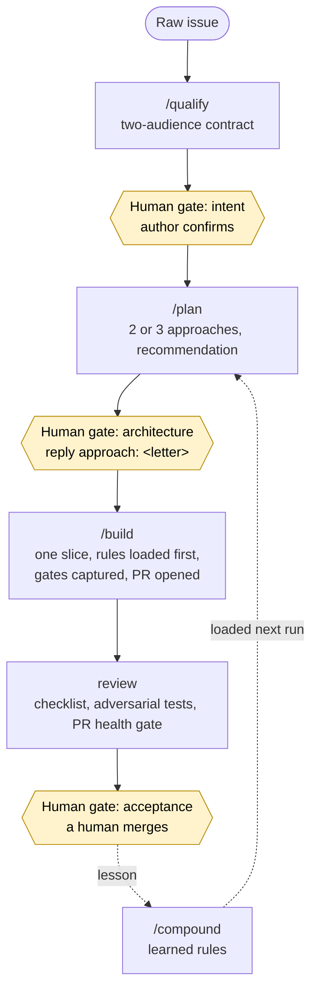

# aifier

**Make your existing codebase a place where AI agents can work safely.**

aifier audits a repository, says what is missing for coding agents to operate under human
control, then installs it: a constitution, verification gates with proof, an issue-based
workflow with three human gates, and a catalogue of learned rules that grows with every cycle.
Everything it installs is Markdown and YAML in your repository, loaded by Claude Code, opencode
and pi.

[](LICENSE)
[](#status)

## Install

From the root of a git repository (macOS, Linux, WSL, Git Bash; needs `git`, `curl`, `tar`, and
`gh` with `jq` to read the forge):

```sh
curl -fsSL https://raw.githubusercontent.com/mickaelandrieu/aifier/main/install.sh | sh
```

It copies the skills into `.agents/skills/` and the `aifier` binary into `.aifier/bin/`, nothing
else. `AIFIER_REF=v1.2.3` pins a release (a branch carries no binary), `AIFIER_DIR` changes the
skills directory, `AIFIER_SRC=/path/to/clone` installs from a local checkout. Run it again to
update; delete the two directories to remove.

Then, in your agent: `/assess` to measure, `/init` to set up, `/gates` to declare the gates, and
the cycle below for every issue. No Python, Node or Rust is needed on the machine that uses aifier.

## The skills

| Skill | Phase | What it does |
|---|---|---|
| `/assess` | 0 Setup | Read-only audit against the eleven phases: score, verdict, gaps in priority order ([grid](method/assess.md)). |
| `/init` | 0 Setup | Detects the stack, confirms `aifier.yml`, renders constitution, area guides, issue and PR templates, memory and skills. Never overwrites silently. |
| `/gates` | 4 Verify | Declares lint, typecheck, test and build per area, compares with CI, runs them with captured output. |
| `/qualify` | 1 Define | Rewrites a raw issue into a two-audience contract, sets `todo`, stops for the author. |
| `/plan` | 2 Plan | Posts two or three approaches that diverge in strategy, stops until a human replies `approach: <letter>`. |
| `/build` | 3 Build | Branches, loads rules and guides, builds one slice, runs the gates, opens a PR with its Verification Run. Never merges. |
| `/gate` | 1 to 3 | Where an issue stands, in one line that names the facts it rests on. |
| `/compound` | 6 and 9 | Turns a lesson into a learned rule, pre-release or from an incident. |
| `/context` | CDLC | Audits what agents read: stale files, duplication, tiering, load per session. |
| `/status` | all | Where the project stands, and the next gap. |

Plus the knowledge skills agents load: proof discipline, review checklist, adversarial test
plan, process rules, decision records, documentation rules.

## The cycle

Agents run the skills; humans hold three decisions. Labels (`<prefix>:todo`, `needs-input`,
`in-progress`, `partial`, `done`) carry the state on the forge.



An agent never decides the intent, picks the approach, merges, or marks a pull request ready.
Each skill checks the gate behind it and stops without the human signal.

## Grounding

The vocabulary comes from published concepts: the
[AI-augmented SDLC](https://www.sfeir.com/concepts/sdlc-augmente/) (eleven phases, three gates,
two capitalisations), [harness engineering](https://www.sfeir.com/concepts/harness-engineering/),
[context engineering](https://www.sfeir.com/concepts/context-engineering/) and the
[CDLC](https://www.sfeir.com/concepts/cdlc/),
[issue-based development](https://www.sfeir.com/concepts/issue-based-development/), the
[context flywheel](https://www.sfeir.com/concepts/context-flywheel/). The method pages are in
[`method/`](method/).

## Layout

```
install.sh   skills into .agents/skills/, the binary of the tag into .aifier/bin/
skills/      the portable skills; each collector is a bash script next to its SKILL.md
templates/   files init renders
src/         the aifier binary (Rust): `aifier render`; update, remove and guards follow
method/      the eleven phases and the assess grid (French)
tests/       synthetic repositories and golden outputs for every collector and the renderer
docs/        this repository's memory: learned rules, decisions, handoff
```

## Status

Alpha, towards `v0.1.0`. Shipped and tested: the installer, fifteen skills (each blind-run
before merging; the cycle has run end to end on this repository), the bash collectors diffed
against golden outputs in CI, and the `aifier` binary with `render`, built for Linux and macOS
on every tag ([ADR 0002](docs/decisions/0002-aifier-binary.md)). Not yet: guards (per-engine
hooks), `aifier update` and `remove`, native Windows, stack packs. Developing aifier needs a
Rust toolchain; using it does not.

aifier uses aifier: this repository was set up with `/init` and its issues go through the cycle.
Open an issue to run the grid on your codebase or to report a friction in a skill.

## License

[MIT](LICENSE).
