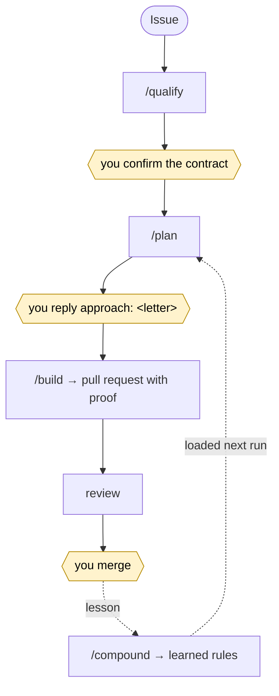

# aifier

**Make your existing codebase a place where AI agents can work safely.**

Coding agents write good code and have no idea where they are. aifier gives them the harness:
a constitution for the repository, gates that produce proof, a workflow that stops at the three
decisions humans must keep, and a catalogue of rules that learns from every review. All of it is
Markdown and YAML in your repository, loaded by Claude Code, opencode and pi.

[](LICENSE)
[](#status)

## Quick start

```sh
# from the root of your git repository
curl -fsSL https://raw.githubusercontent.com/mickaelandrieu/aifier/main/install.sh | sh
```

Then, in your coding agent:

1. `/assess` measures where the repository stands. It changes nothing.
2. `/init` sets it up: it detects your stack, asks what it cannot guess, and renders the files.
3. `/gates` declares lint, typecheck, tests and build, so every agent proves its work.
4. For each issue: `/qualify`, `/plan`, `/build`. See [the cycle](#the-cycle).

Needs macOS, Linux, WSL or Git Bash with `git`, `curl` and `tar`; `gh` and `jq` to read your
forge. No Python, Node or Rust.

<details><summary>Installer options</summary>

The installer puts the skills in `.agents/skills/` and the `aifier` binary in `.aifier/bin/`,
nothing else. `AIFIER_REF=v1.2.3` pins a release (a branch carries no binary), `AIFIER_DIR`
changes the skills directory, `AIFIER_SRC=/path/to/clone` installs from a local checkout. Run it
again to update. Delete the two directories to remove.

</details>

## The skills

| Skill | When | What it does |
|---|---|---|
| `/assess` | first, and any time | Scores the repository against the eleven phases, lists the gaps in priority order ([grid](method/assess.md)). |
| `/init` | once | Renders the constitution, area guides, issue and PR templates, memory and skills. Never overwrites silently. |
| `/gates` | once, then as needed | Declares the verification gates per area, compares with CI, runs them with captured output. |
| `/qualify N` | an issue lands | Turns it into a two-audience contract and stops for the author to confirm. |
| `/plan N` | contract confirmed | Posts two or three approaches that differ in strategy and stops until you reply `approach: <letter>`. |
| `/build N` | approach chosen | Builds one slice under the rules, runs the gates, opens a PR with the proof. Never merges. |
| `/gate N` | any time | Where an issue stands, in one line. |
| `/compound` | after a review or an incident | Turns a lesson into a rule every agent loads next run. |
| `/context` | when agents seem lost | Audits what agents read: stale files, duplication, load per session. |
| `/status` | session start | Where the project stands, and the next gap. |

Agents also load the knowledge skills: proof discipline, review checklist, adversarial test
plan, process rules, decision records, documentation rules.

## The cycle

Agents run the skills. Humans hold three decisions. Labels carry the state on the forge.



An agent never decides the intent, picks the approach, merges, or marks a pull request ready.
Each skill checks the gate behind it and stops without your signal.

## Grounding

The vocabulary is the one of the
[AI-augmented SDLC](https://www.sfeir.com/concepts/sdlc-augmente/): eleven phases, three human
gates, two capitalisations. Related concepts:
[harness engineering](https://www.sfeir.com/concepts/harness-engineering/),
[context engineering](https://www.sfeir.com/concepts/context-engineering/),
[CDLC](https://www.sfeir.com/concepts/cdlc/),
[issue-based development](https://www.sfeir.com/concepts/issue-based-development/),
[context flywheel](https://www.sfeir.com/concepts/context-flywheel/). The method pages are in
[`method/`](method/).

## Status

Alpha, towards `v0.1.0`. Shipped: the installer, fifteen skills, the bash collectors tested
against golden outputs, and the `aifier` binary with `render`, built for Linux and macOS on every
tag ([ADR 0002](docs/decisions/0002-aifier-binary.md)). Not yet: per-engine guards,
`aifier update` and `remove`, native Windows, stack packs.

aifier uses aifier: this repository was set up with `/init` and its issues go through the cycle.
Open an issue to run the grid on your codebase or to report a friction in a skill.

Layout: `install.sh`, `skills/` (one directory per skill, collectors in bash next to the
`SKILL.md`), `templates/`, `src/` (the binary), `method/` (French), `tests/`, `docs/`.

## License

[MIT](LICENSE).
